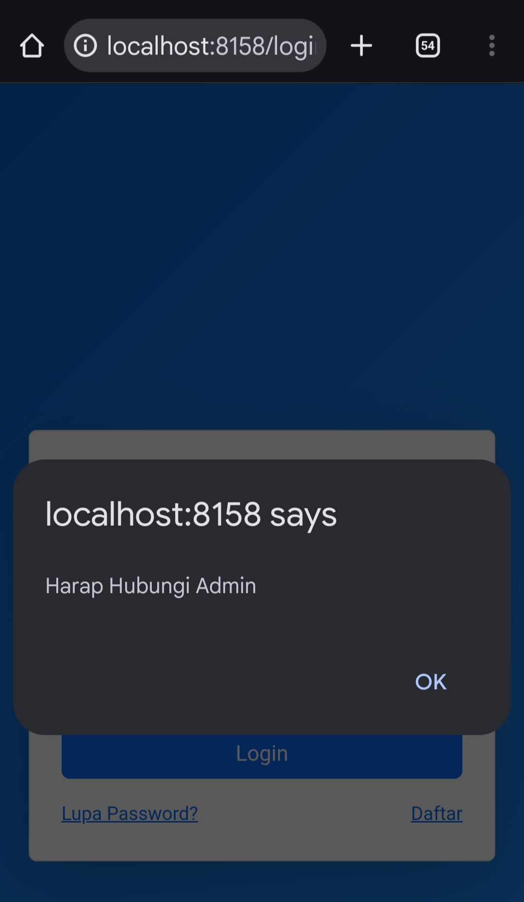
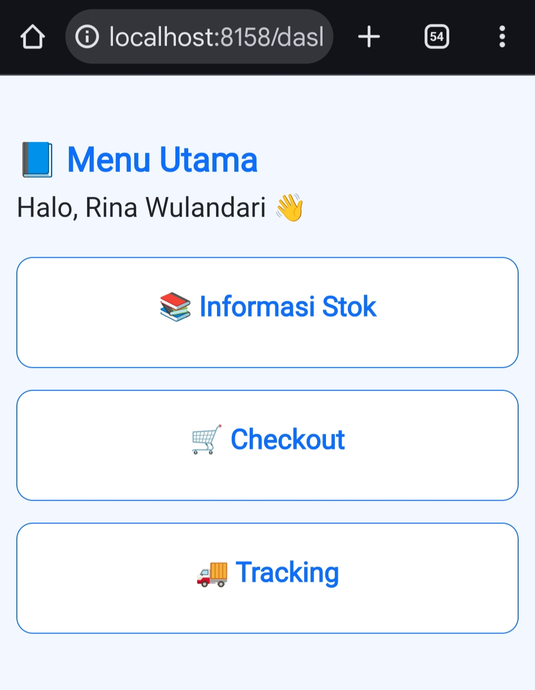
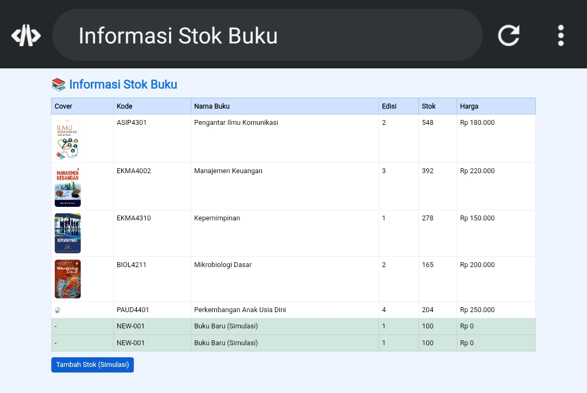
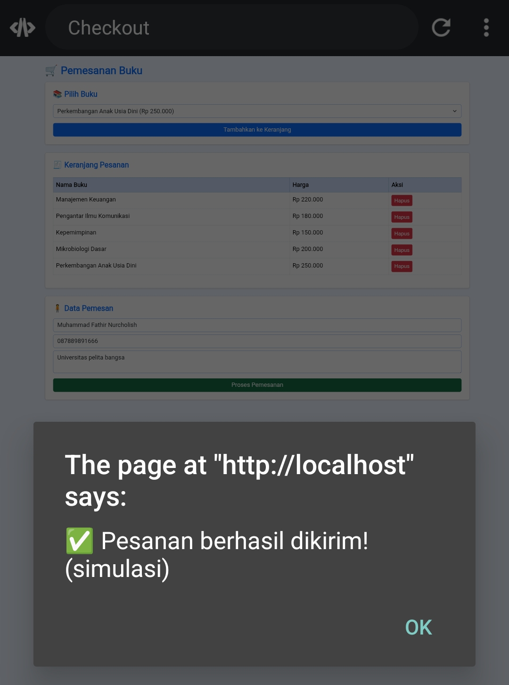
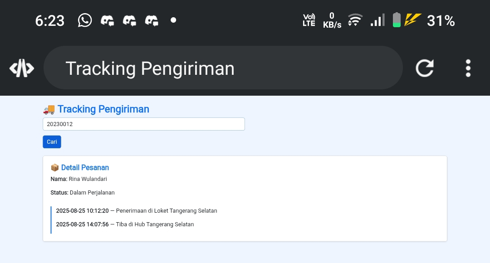

# UTSWEB1
```
NAMA : MUHAMMAD FATHIR NURCHOLIS
NIM : 312410287
KELAS : TI.24.A.4
```

### HALAMAN LOGIN

<br>
Ini adalah tampilan Login/Awal dari website saya. 

<br>
akan muncul tulisan ini jika user salah menginput email/user.

<br>
ini yanga akan muncul ketika user benar memasukkan data email dan pasword. 

<br>
ketika user menekan tombol daftar/lupa pasword. 

### HTML CODE
```html
<!DOCTYPE html>
<html lang="en">
<head>
  <meta charset="UTF-8">
  <meta name="viewport" content="width=device-width, initial-scale=1.0">
  <title>Login - Sistem pemesanan buku</title>
  
  <link rel="stylesheet" href="css/style.css">

  <link href="https://cdn.jsdelivr.net/npm/bootstrap@5.3.2/dist/css/bootstrap.min.css" rel="stylesheet">

  <style>
    body {
      background: linear-gradient(135deg, #0b63ce, #1e90ff);
      height: 100vh;
    }
  </style>
</head>
<body class="d-flex justify-content-center align-items-center">

  <div class="card shadow-lg p-4" style="width: 350px;">
    <h3 class="text-center fw-bold text-primary">LOGIN</h3>

    <div class="form-group mb-3">
      <label>Email</label>
      <input type="email" id="email" class="form-control" placeholder="Masukkan email...">
    </div>

    <div class="form-group mb-4">
      <label>Password</label>
      <input type="password" id="password" class="form-control" placeholder="Masukkan password...">
    </div>

    <button onclick="login()" class="btn btn-primary w-100">Login</button>

    <div class="d-flex justify-content-between mt-3">
      <a href="#" class="text-primary small" onclick="alert('Harap Hubungi Admin')">Lupa Password?</a>
      <a href="#" class="text-primary small" onclick="alert('Harap Hubungi Admin')">Daftar</a>
    </div>
  </div>

  <script src="js/data.js"></script>
  <script src="js/script_login.js"></script>

</body>
</html>
```

### JS CODE
```js
function login() {

  let email = document.getElementById("email").value;
  let password = document.getElementById("password").value;

  let pengguna = dataPengguna.find(
    user => user.email === email && user.password === password
  );

  if (pengguna) {
    alert("Login berhasil 👍");
    sessionStorage.setItem("userLogin", JSON.stringify(pengguna));
    window.location.href = "dashboard.html";
  } else {
    alert("Email atau password salah!");
  }
}
```

### Dashboard
Didalam dashboard, terdapat main menu dengan tombol yang mengarahkan user ke berbagai halaman dan fitur.

Yang pertama sudah pasti ada Dashboard, dashboard akan menampilkan semua halaman yang ingin dituju user.

Tampilan Dashboard :
<br>


### HTML CODE
```html
<!DOCTYPE html>
<html lang="en">
<head>
  <meta charset="UTF-8">
  <meta name="viewport" content="width=device-width, initial-scale=1.0">
  <title>Dashboard</title>

  <link href="https://cdn.jsdelivr.net/npm/bootstrap@5.3.2/dist/css/bootstrap.min.css" rel="stylesheet">
  
  <link rel="stylesheet" href="css/style.css">

  <style>
    body { background-color: #f3f7ff; }
    .menu-card:hover { transform: scale(1.05); transition: .3s; }
  </style>
</head>
<body>

<div class="container mt-5">
  <h2 class="fw-bold text-primary">📘 Menu Utama</h2>
  <h5>Halo, <span id="namaUser"></span> 👋</h5>

  <div class="row mt-4">

    <div class="col-md-3 mb-3">
      <a href="stok.html" class="text-decoration-none">
        <div class="card p-4 text-center border-primary menu-card">
          <h5 class="text-primary fw-bold">📚 Informasi Stok</h5>
        </div>
      </a>
    </div>

    <div class="col-md-3 mb-3">
      <a href="checkout.html" class="text-decoration-none">
        <div class="card p-4 text-center border-primary menu-card">
          <h5 class="text-primary fw-bold">🛒 Checkout</h5>
        </div>
      </a>
    </div>

    <div class="col-md-3 mb-3">
      <a href="tracking.html" class="text-decoration-none">
        <div class="card p-4 text-center border-primary menu-card">
          <h5 class="text-primary fw-bold">🚚 Tracking</h5>
        </div>
      </a>
    </div>

  </div>
</div>

<script>
  let user = JSON.parse(sessionStorage.getItem("userLogin"));
  document.getElementById("namaUser").innerText = user.nama;
</script>

</body>
</html>
```

### Informasi Stok
Setelah Dashboard, tombol paling atas akan mengalihkan user ke halaman Informasi stok buku
<br>

Disini user bisa melihat-lihat buku yang dijual
dan ada berapa stoknya serta bisa melihat harganya, Admin juga bisa menambahkan buku baru. 

berikut tampilannya:
<br>

### HTML CODE
```html
<!DOCTYPE html>
<html lang="en">
<head>
  <meta charset="UTF-8">
  <meta name="viewport" content="width=device-width, initial-scale=1.0">
  <title>Informasi Stok Buku</title>
  
  <link rel="stylesheet" href="css/style.css">

  <link href="https://cdn.jsdelivr.net/npm/bootstrap@5.3.2/dist/css/bootstrap.min.css" rel="stylesheet">
  <style> body { background: #eef5ff; } img { border-radius: 6px; } </style>
</head>
<body>

<div class="container mt-4">

  <h3 class="fw-bold text-primary">📚 Informasi Stok Buku</h3>
  <table class="table table-bordered table-hover mt-3">
    <thead class="table-primary">
      <tr>
        <th>Cover</th>
        <th>Kode</th>
        <th>Nama Buku</th>
        <th>Edisi</th>
        <th>Stok</th>
        <th>Harga</th>
      </tr>
    </thead>
    <tbody id="tabelStok"></tbody>
  </table>

  <button class="btn btn-primary" onclick="tambahStok()">Tambah Stok (Simulasi)</button>
</div>

<script src="js/data.js"></script>

<script>
  dataKatalogBuku.forEach(buku => {
    document.getElementById("tabelStok").innerHTML += `
      <tr>
        <td></td>
        <td>${buku.kodeBarang}</td>
        <td>${buku.namaBarang}</td>
        <td>${buku.edisi}</td>
        <td>${buku.stok}</td>
        <td>${buku.harga}</td>
      </tr>
    `;
  });

  function tambahStok() {
    document.getElementById("tabelStok").innerHTML += `
      <tr class="table-success">
        <td>-</td>
        <td>NEW-001</td>
        <td>Buku Baru (Simulasi)</td>
        <td>1</td>
        <td>100</td>
        <td>Rp 0</td>
      </tr>
    `;
  }
</script>

</body>
</html>
```

### CHECKOUT / PEMESANAN
Pemesanan buku, secara online. Pengguna bisa membeli buku dibagian ini. Tampilannya :
<br>

jika sudah memesan akan muncul seperti ini :
<br>

### HTML CODE
```html
<!DOCTYPE html>
<html lang="en">
<head>
  <meta charset="UTF-8">
  <meta name="viewport" content="width=device-width, initial-scale=1.0">
  <title>Checkout</title>
  
  <link rel="stylesheet" href="css/style.css">

  <link href="https://cdn.jsdelivr.net/npm/bootstrap@5.3.2/dist/css/bootstrap.min.css" rel="stylesheet">
  <style> body { background: #eef5ff; } </style>
</head>
<body>

<div class="container mt-4">

  <h3 class="fw-bold text-primary">🛒 Pemesanan Buku</h3>

  <div class="card p-4 shadow-sm mt-3">
    <h5 class="fw-bold text-primary">📚 Pilih Buku</h5>
    <select id="pilihBuku" class="form-select mt-2"></select>
    <button onclick="tambahKeKeranjang()" class="btn btn-primary w-100 mt-3">Tambahkan ke Keranjang</button>
  </div>

  <div class="card p-4 mt-4 shadow-sm">
    <h5 class="fw-bold text-primary">🧾 Keranjang Pesanan</h5>
    <table class="table table-bordered mt-3">
      <thead class="table-primary">
        <tr><th>Nama Buku</th><th>Harga</th><th>Aksi</th></tr>
      </thead>
      <tbody id="tabelKeranjang"></tbody>
    </table>
  </div>

  <div class="card p-4 mt-4 shadow-sm">
    <h5 class="fw-bold text-primary">🧍 Data Pemesan</h5>
    <input id="nama" class="form-control mt-2" placeholder="Nama Pemesan">
    <input id="hp" class="form-control mt-2" placeholder="Nomor HP">
    <textarea id="alamat" class="form-control mt-2" placeholder="Alamat"></textarea>
    <button onclick="prosesPesanan()" class="btn btn-success mt-3 w-100">Proses Pemesanan</button>
  </div>

</div>

<script src="js/data.js"></script>
<script>
  let keranjang = [];

  function loadPilihanBuku() {
    dataKatalogBuku.forEach(buku => {
      document.getElementById("pilihBuku").innerHTML += `
        <option value="${buku.namaBarang}" data-harga="${buku.harga}">
          ${buku.namaBarang} (${buku.harga})
        </option>`;
    });
  }
  loadPilihanBuku();

  function tambahKeKeranjang() {
    let select = document.getElementById("pilihBuku");
    let nama = select.value;
    let harga = select.options[select.selectedIndex].dataset.harga;

    keranjang.push({ nama, harga });

    document.getElementById("tabelKeranjang").innerHTML += `
      <tr>
        <td>${nama}</td>
        <td>${harga}</td>
        <td><button class="btn btn-danger btn-sm" onclick="hapusItem(this)">Hapus</button></td>
      </tr>`;
  }

  function hapusItem(btn) {
    btn.parentElement.parentElement.remove();
  }

  function prosesPesanan() {
    if (keranjang.length === 0) return alert("Tambahkan buku ke keranjang dulu!");
    alert("✅ Pesanan berhasil dikirim! (simulasi)");
  }
</script>

</body>
</html>
```

### TRACKING
Fitur ini berguna bagi orang yang ingin melihat paket buku yang di pesannya. 
<br>

### HTML CODE
```html
<!DOCTYPE html>
<html lang="en">
<head>
  <meta charset="UTF-8">
  <meta name="viewport" content="width=device-width, initial-scale=1.0">
  <title>Tracking Pengiriman</title>
  
  <link rel="stylesheet" href="css/style.css">

  <link href="https://cdn.jsdelivr.net/npm/bootstrap@5.3.2/dist/css/bootstrap.min.css" rel="stylesheet">
  <style>
    body { background: #eef5ff; }
    .timeline { border-left: 3px solid #0d6efd; padding-left: 15px; margin-top: 15px; }
  </style>
</head>
<body>

<div class="container mt-4">

  <h3 class="fw-bold text-primary">🚚 Tracking Pengiriman</h3>
  <input id="inputDO" type="text" class="form-control w-50" placeholder="Masukkan Nomor DO">
  <button onclick="cariTracking()" class="btn btn-primary mt-3">Cari</button>

  <div id="hasilTracking" class="mt-4"></div>
</div>

<script src="js/data.js"></script>

<script>
  function cariTracking() {
    const no = document.getElementById("inputDO").value.trim();
    const data = dataTracking[no];

    if (!data) {
      hasilTracking.innerHTML = `<div class="alert alert-danger">Nomor DO tidak ditemukan.</div>`;
      return;
    }

    let html = `
    <div class="card p-4 shadow-sm">
      <h5 class="fw-bold text-primary">📦 Detail Pesanan</h5>
      <p><b>Nama:</b> ${data.nama}</p>
      <p><b>Status:</b> ${data.status}</p>
      <div class="timeline">`;

    data.perjalanan.forEach(p => {
      html += `<p><b>${p.waktu}</b> — ${p.keterangan}</p>`;
    });

    html += `</div></div>`;
    document.getElementById("hasilTracking").innerHTML = html;
  }
</script>

</body>
</html>
```


### CSS
berikut adalah css yang di gunakan untuk seluruh file :
```css
/* ===== DEFAULT BODY ===== */
body {
    font-family: Arial, sans-serif;
    background-color: #eef5ff;        /* warna biru muda */
    margin: 0;
    padding: 0;
}

/* ===== NAVBAR (jika nanti kamu tambah navbar) ===== */
.navbar-custom {
    background-color: #0b63ce !important;
}
.navbar-custom .nav-link {
    color: white !important;
    font-weight: 500;
}

/* ===== CARD DEFAULT (BOX untuk form, dashboard menu) ===== */
.card {
    border-radius: 12px;
    border: 1px solid #d6e4ff;
}

/* ===== BUTTON STYLE ===== */
.btn-primary {
    background-color: #0b63ce;
    border: none;
}
.btn-primary:hover {
    background-color: #084a99;
}

.btn-success {
    background-color: #1ea34a;
}

/* ===== TABLE ===== */
.table-primary {
    background-color: #0b63ce !important;
    color: white !important;
}

table img {
    border-radius: 8px;
}

/* ===== INPUT ===== */
input, select, textarea {
    border-radius: 6px !important;
    border: 1px solid #7aa7e9 !important;
}

/* ===== LOGIN PAGE CUSTOM ===== */
.login-container {
    width: 350px;
    background: white;
    padding: 25px;
    border-radius: 12px;
    box-shadow: 0 0 15px rgba(0,0,0,0.2);
}
```

### js
Ini adalah isi dari data.js yang digunakan untuk sebagai database. 
```js
var dataPengguna = [
    { id: 1, nama: "Rina Wulandari", email: "rina@gmail.com", password: "rina123", role: "User" },
    { id: 2, nama: "Agus Pranoto", email: "agus@gmail.com", password: "agus123", role: "User" },
    { id: 3, nama: "Siti Marlina", email: "siti@gmail.com", password: "siti123", role: "Admin" }
]

var dataKatalogBuku = [
    { kodeBarang: "ASIP4301", namaBarang: "Pengantar Ilmu Komunikasi", jenisBarang: "Buku Ajar", edisi: "2", stok: 548, harga: "Rp 180.000", cover: "img/pengantar_komunikasi.jpg" },
    { kodeBarang: "EKMA4002", namaBarang: "Manajemen Keuangan", jenisBarang: "Buku Ajar", edisi: "3", stok: 392, harga: "Rp 220.000", cover: "img/manajemen_keuangan.jpg" },
    { kodeBarang: "EKMA4310", namaBarang: "Kepemimpinan", jenisBarang: "Buku Ajar", edisi: "1", stok: 278, harga: "Rp 150.000", cover: "img/kepemimpinan.jpg" },
    { kodeBarang: "BIOL4211", namaBarang: "Mikrobiologi Dasar", jenisBarang: "Buku Ajar", edisi: "2", stok: 165, harga: "Rp 200.000", cover: "img/mikrobiologi.jpg" },
    { kodeBarang: "PAUD4401", namaBarang: "Perkembangan Anak Usia Dini", jenisBarang: "Buku Ajar", edisi: "4", stok: 204, harga: "Rp 250.000", cover: "img/paud_perkembangan.jpeg" }
]

var dataTracking = {
    "20230012": {
        nomorDO: "20230012",
        nama: "Rina Wulandari",
        status: "Dalam Perjalanan",
        ekspedisi: "JNE",
        tanggalKirim: "2025-08-25",
        total: "Rp 180.000",
        perjalanan:[
            { waktu: "2025-08-25 10:12:20", keterangan: "Penerimaan di Loket Tangerang Selatan" },
            { waktu: "2025-08-25 14:07:56", keterangan: "Tiba di Hub Tangerang Selatan" }
        ]
    }
}
```
Terdapat Nama, Alamat, dll. 
